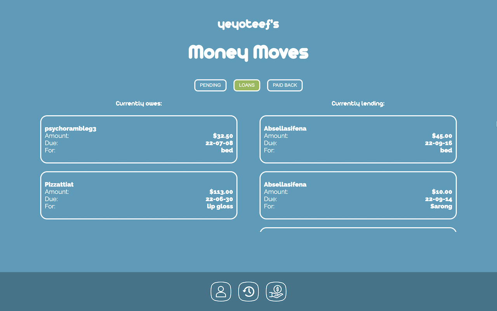
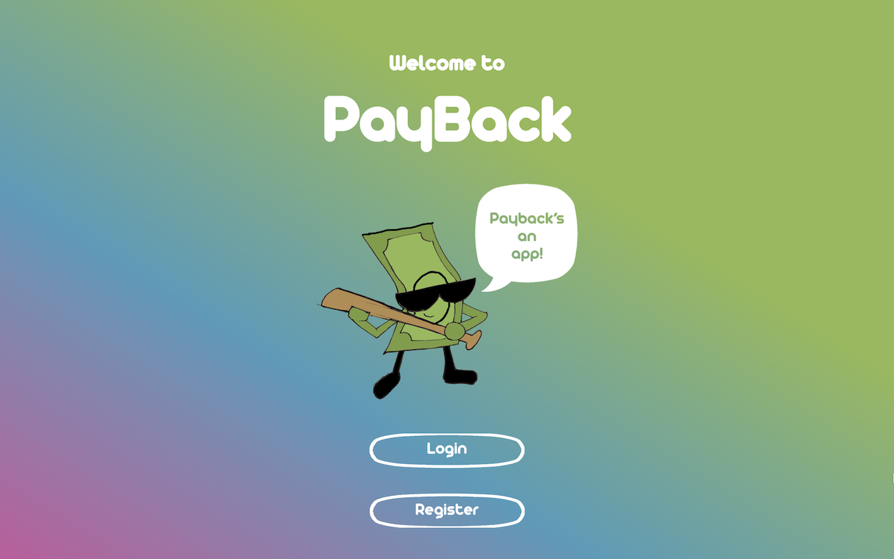

# PAYBACK APP

GDI 2022 Hackathon award winner loan tracker application. Registered users may make borrow requests to another user, who will approve or deny it. If approved, the transaction gets tracked until paid-off.

## Table of contents

- [Overview](#overview)
  - [The Goal](#the-goal)
  - [Screenshots](#screenshots)
  - [Links](#links)
- [Tech](#tech)
  - [Built With](#built-with)
  - [Running](#running)
- [Contributors](#contributors)

## Overview

Four day hackathon event hosted by Girl, Develop it! A team of eight was put together to solve the following problem:

- Sometimes lending money to friends and family members can cause some stress. Its always easy for someone we care about to simply "forget" to pay us back, generating a possible uncomfortable situation.

### The Goal

Deliver MVP with the following features:

- Login/Register
- Create Borrow Requests
- Have lender approve or deny the request
- Track that transaction
- Ability for the lender to mark a transaction as "paid"
- Ability for the lender to rate the borrower

### Screenshots

### Links

- GitHub: [https://github.com/jackieodonnell/PayBack-App](https://github.com/jackieodonnell/PayBack-App)
- Live MVP: [https://paybackapp.onrender.com/](https://paybackapp.onrender.com/)

## Tech

### Built With

- Frontend
  - React.js with CRA TypeScript templated
- Backend
  - Node.js
  - Express
  - Jest
- DB
  - Postgres
- Tech
  - Discord
  - Slack
  - VS Code live-share extension
  - git/Github
- Management
  - Agile/SCRUM
  - Github Projects

### Running

#### Fork/Clone

- Fork/Clone project
- On the root, run `npm install` to install backend dependencies
- `cd client` and run `npm install` to install client dependencies
- Create .env file on the root and add: `TOKEN_SECRET=chooseStringWithoutQuotes`

#### DB Set up

> do once on local machine - from home directory

- (Mac) brew install postgresql
- brew services start postgresql
- psql postgres
- CREATE ROLE postgres WITH LOGIN PASSWORD 'postgres1';
- ALTER ROLE postgres CREATEDB;
- \q
- psql postgres -U postgres

> do every time re-setting database - from project directory

- cd server/database
- sh create.sh

#### Run development

- At the root, run `npm run dev` to start the API
- On a second terminal, `cd client` and `npm start`

### Contributors

#### SCRUM Master

---

**:point_right: Cappreccia Swanson**
:e-mail: capprecciaswanson@gmail.com
:computer: [Linkedin](https://www.linkedin.com/in/cappreccia-swanson)

---

#### Data Analyst

---

**:point_right: Alondra Perez Cortez**
:e-mail: apcalondraperezcortez@gmail.com
:computer: [Portfolio](https://sites.google.com/view/alondra-perez-cortez/projects)

---

#### Product Owner

---

**:point_right: LaToya Simon**
:e-mail: 1stforgottentoy@gmail.com
:computer: [Github](https://github.com/latoyadsimon)

---

#### UI/UX

---

**:point_right: Audra Omlie**
:e-mail: audraomlie@gmail.com
:computer: [Linkedin](linkedin.com/in/audraomlie)

---

#### Frontend

---

**:point_right: Olivia Bloway**
:e-mail: [Linkedin](https://www.linkedin.com/in/liv-bloway-461306211/)
:computer: [Portfolio](www.oliviabloway.com)

---

**:point_right: Denasia Furniss**
:e-mail: denasiafurniss@gmail.com
:computer: [Portfolio](denasia-furniss-portfolio.herokuapp.com/)

---

#### Backend

---

**:point_right: Jacqueline O'Donnell**
:e-mail: [Linkedin](https://www.linkedin.com/in/jackieodonnell/)
:computer: [Github](https://github.com/jackieodonnell)

---

**:point_right: Aryse Tansy**
:e-mail: paganowebdev@gmail.com
:computer: [Portfolio](https://www.pagano.dev/)

---
